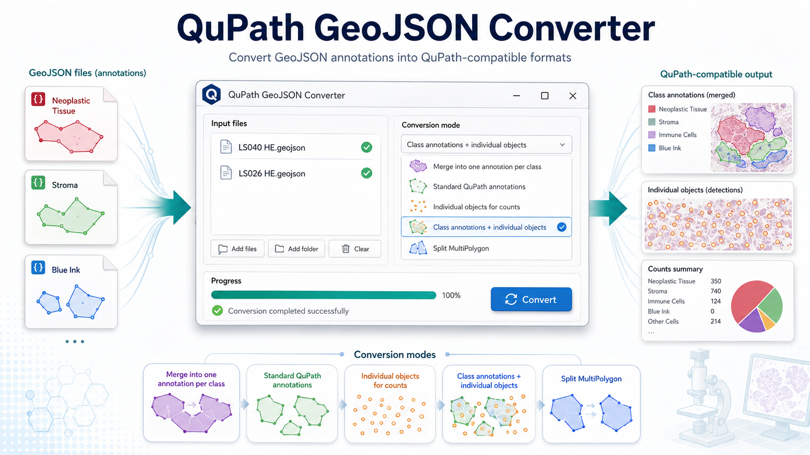
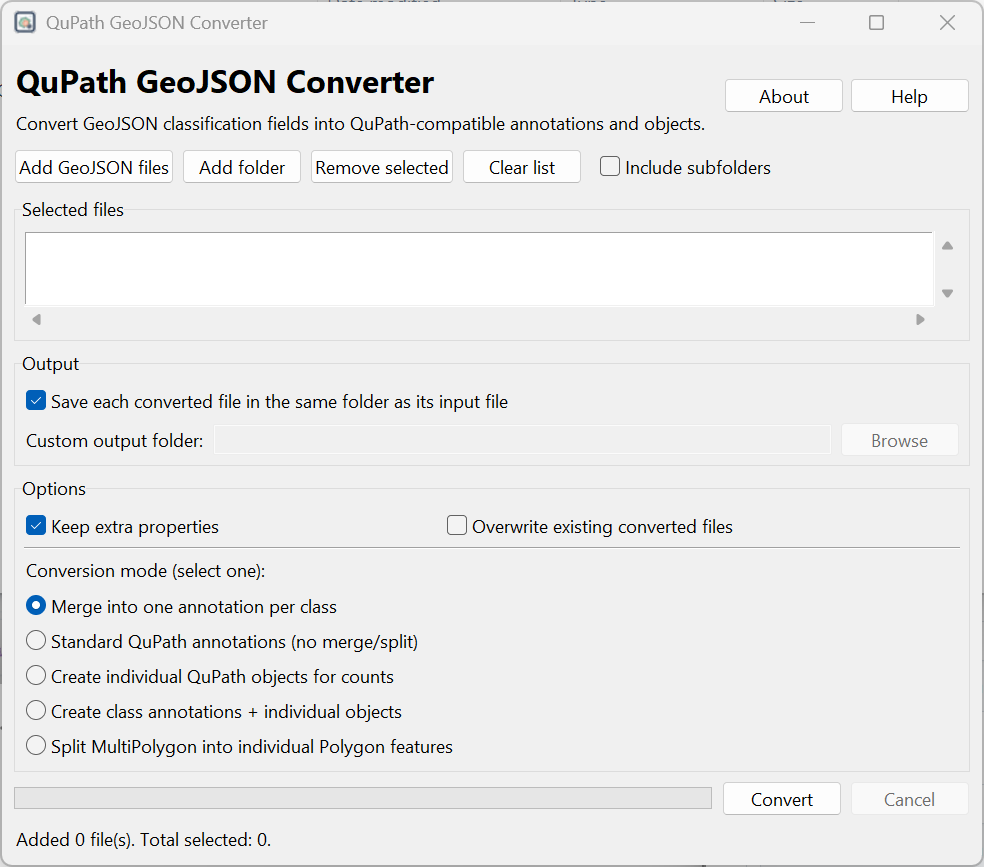
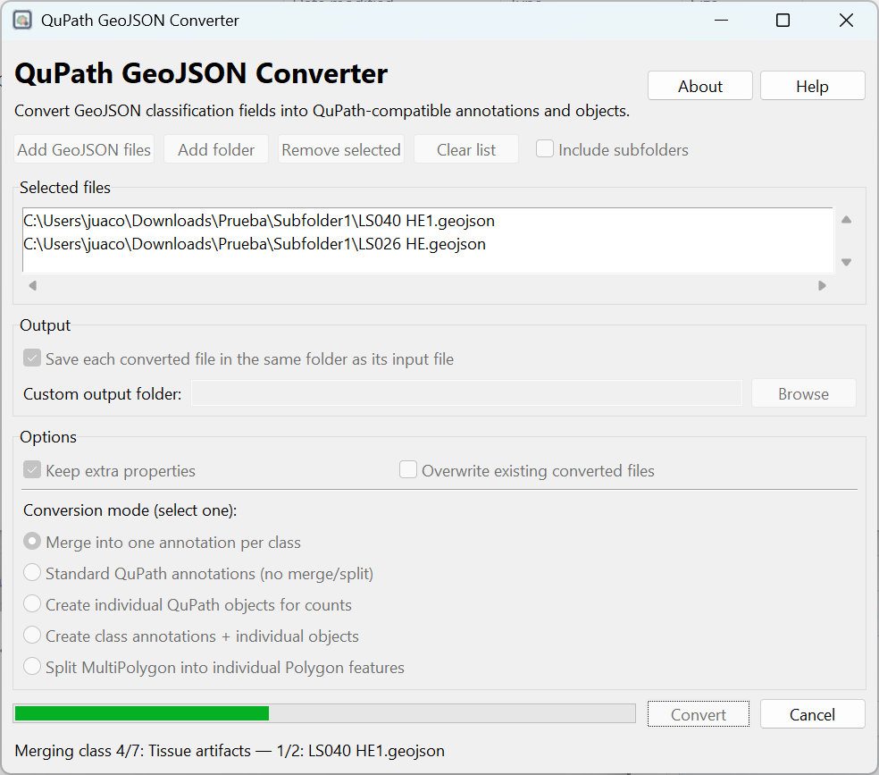
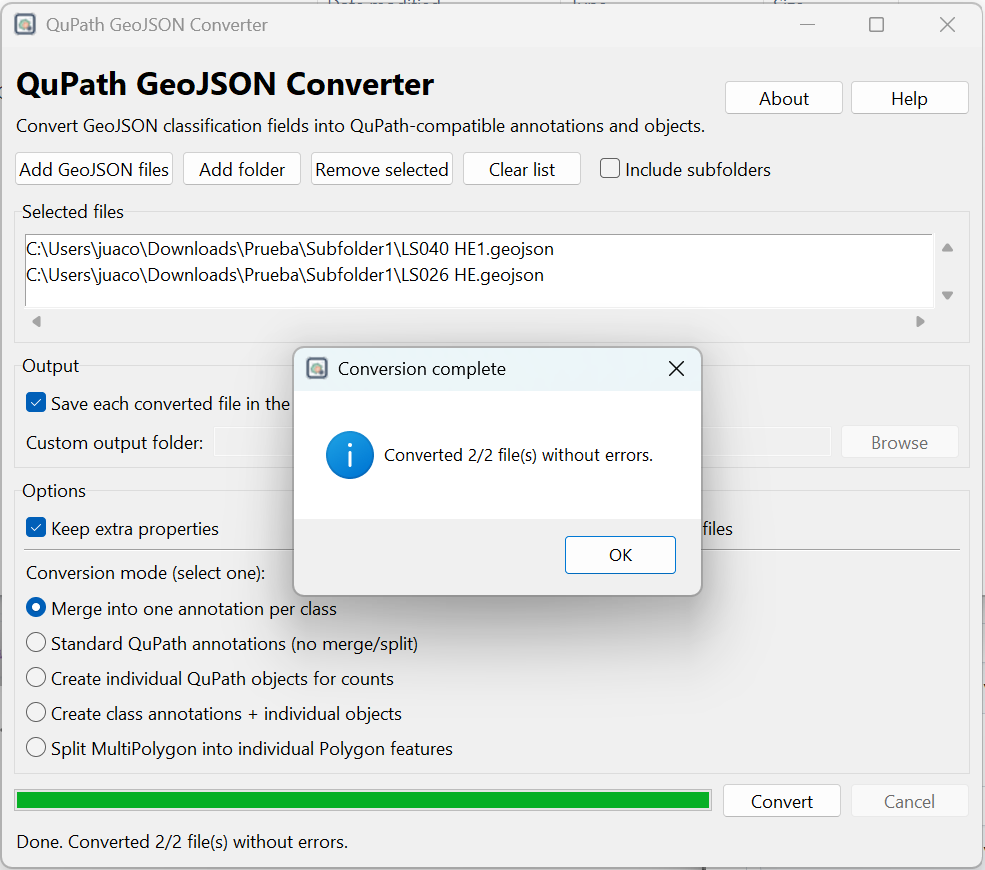

# QuPath GeoJSON Converter

[](https://doi.org/10.5281/zenodo.20496387)


**QuPath GeoJSON Converter** is a lightweight desktop application for converting GeoJSON annotation files into QuPath-compatible annotation and detection formats.

It is designed for GeoJSON files generated by external annotation or segmentation tools that store class information using fields such as `class_name` and `class_color_hex`. The converter rewrites these fields into QuPath-style properties using `objectType` and `classification`.



## Features

- Convert one or multiple GeoJSON files.
- Select individual files or process all GeoJSON files in a folder.
- Optional recursive folder search.
- Save converted files in the original folder or in a custom output folder.
- Preserve extra metadata fields when needed.
- Overwrite or safely skip existing converted files.
- Progress bar during conversion.
- Error log shown only when conversion errors occur.
- Simple graphical interface built with Tkinter.
- Includes an About dialog with version, GitHub repository, ORCID, and Zenodo DOI.
- Designed to be packaged as a standalone desktop app.

## Screenshots

### Main interface



### Conversion in progress



### Conversion completed



## Conversion modes

The application provides five mutually exclusive conversion modes.

### 1. Merge into one annotation per class

Creates one QuPath annotation for each class. All geometries belonging to the same class are merged into a single class-level annotation.

Example:

```text
Annotation: Neoplastic Tissue
Annotation: Stroma
Annotation: Blue Ink
```

This is useful when the goal is to create broad class-level regions in QuPath.

### 2. Standard QuPath annotations

Converts each input GeoJSON feature into one QuPath annotation without merging, splitting, or converting the geometry into objects.

Example:

```text
Input feature 1 -> QuPath annotation 1
Input feature 2 -> QuPath annotation 2
Input feature 3 -> QuPath annotation 3
```

This is the safest general-purpose conversion mode.

### 3. Create individual QuPath objects for counts

Converts each input feature into a QuPath detection/object instead of an annotation.

This is useful when the goal is to obtain class-specific object counts in QuPath.

### 4. Create class annotations + individual objects

Creates one class-level annotation and also keeps individual objects for that class.

Example:

```text
Annotation: Neoplastic Tissue
   object 1: Neoplastic Tissue
   object 2: Neoplastic Tissue
   object 3: Neoplastic Tissue
```

This is useful when both class-level regions and object-level counts are needed.

### 5. Split MultiPolygon into individual Polygon features

Splits MultiPolygon geometries into individual Polygon annotations.

This can help when QuPath has problems importing complex MultiPolygon geometries.

## Expected input

The tool is designed for GeoJSON files containing classification metadata such as:

```json
{
  "class_name": "Neoplastic Tissue",
  "class_color_hex": "#FF0100"
}
```

The converted QuPath-compatible output uses:

```json
{
  "objectType": "annotation",
  "classification": {
    "name": "Neoplastic Tissue",
    "color": [255, 1, 0]
  }
}
```

Depending on the selected conversion mode, `objectType` may also be written as `detection` for QuPath object/count workflows.

## Output files

Converted files are saved with the suffix:

```text
_qupath.geojson
```

Example:

```text
LS026 HE.geojson
LS026 HE_qupath.geojson
```

## Installation from source

Clone the repository:

```bash
git clone https://github.com/Juaco2r/qupath-geojson-converter.git
cd qupath-geojson-converter
```

Create and activate a virtual environment.

Windows PowerShell:

```powershell
python -m venv .venv
.\.venv\Scripts\activate
```

macOS/Linux:

```bash
python -m venv .venv
source .venv/bin/activate
```

Install dependencies:

```bash
pip install -r requirements.txt
```

Run the app:

```bash
python qupath_geojson_converter_gui.py
```

## Requirements

- Python 3.9 or later
- Shapely
- Tkinter

Tkinter is included with most standard Python installations. On some Linux distributions, it may need to be installed separately.

For example, on Ubuntu/Debian:

```bash
sudo apt-get install python3-tk
```

## Build locally with PyInstaller

Install PyInstaller:

```bash
pip install pyinstaller
```

Build using the included spec file:

```bash
pyinstaller --clean --noconfirm qupath_geojson_converter_gui.spec
```

The built application will be created in the `dist/` folder.

## Build with GitHub Actions

This repository includes a GitHub Actions workflow at:

```text
.github/workflows/build.yml
```

The workflow builds the application on Windows, macOS, and Linux, and uploads the generated files as workflow artifacts.

To trigger the workflow manually:

1. Go to the repository on GitHub.
2. Open the **Actions** tab.
3. Select **Build desktop app**.
4. Click **Run workflow**.

## Repository structure

Suggested structure:

```text
qupath-geojson-converter/
├── qupath_geojson_converter_gui.py
├── qupath_geojson_converter_gui.spec
├── requirements.txt
├── README.md
├── LICENSE
├── CITATION.cff
├── .zenodo.json
├── assets/
│   ├── icon/
│   │   ├── qupath_geojson_converter.ico
│   │   └── qupath_geojson_converter.icns
│   └── screenshots/
│       ├── QuPath_convert_concept.png
│       ├── Screenshot_app.png
│       ├── Screenshot_app_conversion.png
│       └── Screenshot_app_completed.png
└── .github/
    └── workflows/
        └── build.yml
```

## Citation

If you use this software, please cite:

```text
Rodriguez J. QuPath GeoJSON Converter. Version 1.0.0. Zenodo.
https://doi.org/10.5281/zenodo.20496387
```

DOI:

```text
10.5281/zenodo.20496387
```

## Suggested GitHub topics

```text
qupath
geojson
digital-pathology
computational-pathology
whole-slide-imaging
image-annotation
pathology
python
tkinter
annotation-converter
```

## Disclaimer

This is an independent utility and is not affiliated with or endorsed by the QuPath project.
